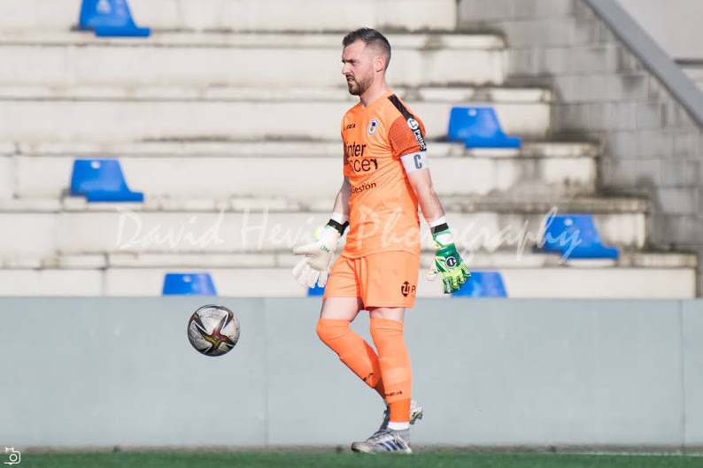

[← Volver al inicio](README.md)
# Temas del curso

###  18/09 - Mis aficiones

Llevo desde los 4 años jugando a fútbol, me he movido entre equipos de mi pueblo.
Lo que más me gusta es el conseguir parar los tiros que antes me parecía imposible. 
Entreno los lunes, miércoles y viernes y los sábados juego un partido. Mi portero favorito es Iker Casillas.
También ayudo a mis amigos a componer alguna canción.

[Más información del deporte](https://github.com/jokecamp/FootballData)

### 1/10 - Premios Princesa de Asturias

Lionel Messi es uno de los futbolistas más reconocidos y ha sido nominado al premio princesa de Asturias de los deportes
del 2026 por varias razones entre ellas están: ser el jugador con más títulos de la historia, su influencia en el deporte
y una gran carrera tanto individual como colectiva.
En lo personal me gustaría que lo ganara porque ha marcado parte de mi infancia y ha sido uno de mis jugadores favoritos.

